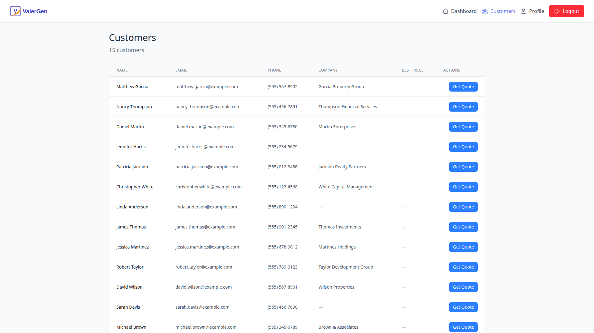
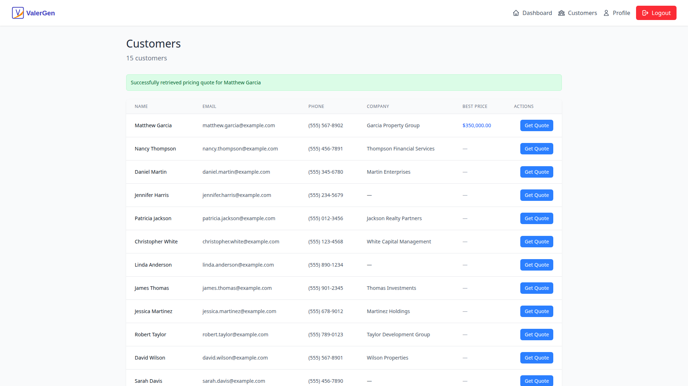
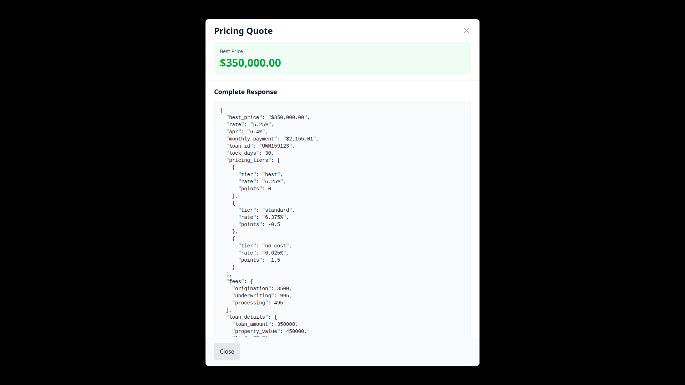
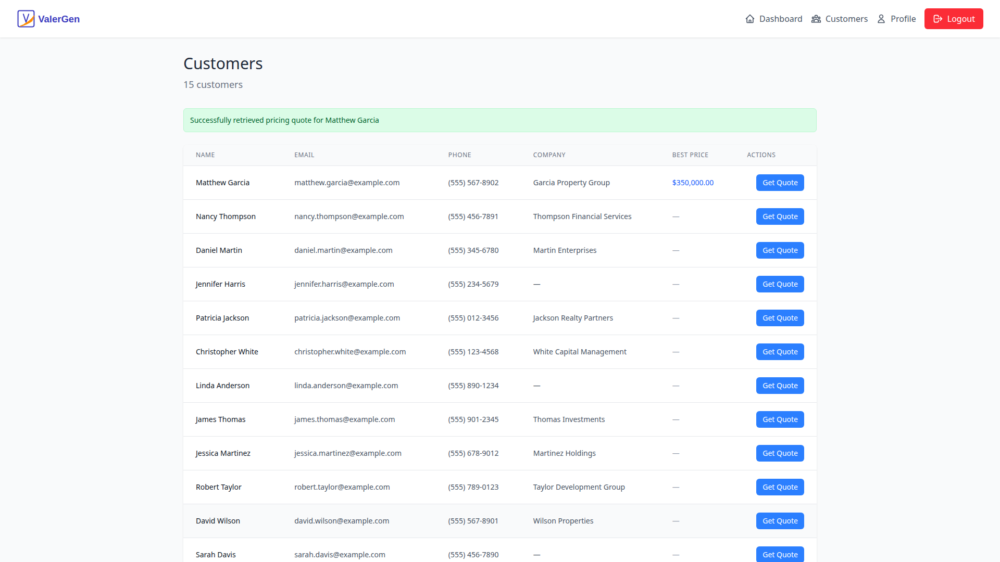

# Customers Menu & Pricing Quote Flow

**Date:** 2025-12-14
**Specification:** specs/issue-06-planner-customers-pricing-quote-flow.md

## Overview

This feature adds a complete customer management and pricing quote workflow to the Valargen application. Users can view a list of customers, request real-time pricing quotes for mortgage products through the UWM API integration, and view detailed pricing responses in an interactive modal. The implementation follows multi-tenant architecture with proper security scoping and provides inline loading states for optimal user experience.

## Screenshots

### Customers List View


### Pricing Quote Retrieved


### Pricing Details Modal


### Modal Closed State


## What Was Built

- **Customers Navigation Menu** - New "Customers" link in the application navbar
- **Customer List View** - Table displaying customer records with pagination support (15 sample customers seeded)
- **Get Quote Action** - Per-customer button to request instant pricing quotes for non-HELOC loan products
- **Real-time Loading States** - Inline spinners showing quote request progress per table row
- **Pricing Response Storage** - Database models and services for persisting quote responses
- **Best Price Display** - Clickable links showing the best available price after successful quotes
- **Pricing Details Modal** - Popup displaying comprehensive pricing information including full JSON response
- **Customer Management API** - RESTful endpoints for CRUD operations on customers
- **Pricing Quote API** - Integration with UWM instant price quote API
- **Multi-tenant Security** - All operations properly scoped to user's tenant_id
- **Sample Data** - Seed script generating 15 realistic customer records

## Technical Implementation

### Backend Files Modified/Created

- `app/server/models/customer.py` - Customer model with tenant scoping, name, email, phone, company_name
- `app/server/models/pricing_quote.py` - PricingQuote model storing quote responses with JSONB full_response field
- `app/server/schemas/customer.py` - Pydantic schemas for Customer (Create, Update, Response, List)
- `app/server/schemas/pricing_quote.py` - Pydantic schemas for PricingQuote (Request, Response)
- `app/server/services/customer_service.py` - Customer business logic with tenant-scoped CRUD operations
- `app/server/services/pricing_service.py` - UWM API integration using httpx for async HTTP requests
- `app/server/routers/customers.py` - Customer endpoints (POST /, GET /, GET /{id}, PATCH /{id})
- `app/server/routers/pricing.py` - Pricing endpoint (POST /quote)
- `app/server/alembic/versions/493e9d321d7f_add_customers_table.py` - Database migration for customers and pricing_quotes tables
- `app/server/scripts/seed_customers.py` - Script to generate 15 sample customers with Faker library
- `app/server/config.py` - Added UWM API configuration (URL, API key, timeout)
- `app/server/main.py` - Registered customers and pricing routers
- `app/server/models/__init__.py` - Registered Customer and PricingQuote models
- `app/server/routers/__init__.py` - Exported customers and pricing routers

### Frontend Files Modified/Created

- `app/client/src/views/CustomersView.vue` - Main customers page with table and modal integration
- `app/client/src/components/CustomerTable.vue` - Table component displaying customers with inline quote actions and loading states
- `app/client/src/components/PricingModal.vue` - Modal component showing best price and full JSON response
- `app/client/src/services/customerService.js` - Customer API calls (list, get, create, update)
- `app/client/src/services/pricingService.js` - Pricing API calls (getQuote)
- `app/client/src/router/index.js` - Added /customers route with requiresAuth meta
- `app/client/src/components/AppNavbar.vue` - Added Customers navigation link with icon

### Testing

- `.claude/commands/e2e/test_customers_pricing_flow.md` - E2E test specification covering the complete workflow
- `app/server/tests/conftest.py` - Updated test fixtures for customer and pricing models
- Multiple backend unit tests added for customer and pricing services

### Key Changes

- **Multi-tenant Database Schema**: Created customers and pricing_quotes tables with proper tenant_id foreign keys and cascade relationships
- **Service Layer Architecture**: Implemented CustomerService and PricingService following existing patterns with async/await and proper error handling
- **RESTful API Design**: Created authenticated endpoints with proper HTTP status codes, validation, and security scoping
- **UWM API Integration**: Built PricingService with httpx AsyncClient for external API calls, including timeout handling and response parsing
- **Reactive UI Components**: Created Vue 3 components with computed properties, event emitters, and reactive loading states
- **Per-row Loading States**: Implemented `loadingQuotes` ref as an object mapping customer IDs to loading states for precise UI feedback
- **Quote Storage**: Stored pricing responses in database with JSONB column for full API response preservation
- **Modal with JSON Display**: Created reusable PricingModal with best price header and formatted JSON body

## How to Use

### Viewing Customers

1. Log in to the Valargen application
2. Click "Customers" in the navigation bar
3. View the list of customers with their details (Name, Email, Phone, Company)
4. The header shows the total count of customers

### Requesting a Pricing Quote

1. Navigate to the Customers page
2. Locate the customer for whom you want a pricing quote
3. Click the "Get Quote" button in the Actions column
4. A spinner will appear in the same row indicating the request is in progress
5. After a few seconds, the spinner disappears and a best price link appears in the "Best Price" column
6. A success message appears at the top of the page

### Viewing Pricing Details

1. After successfully requesting a quote, click the best price link (e.g., "$350,000.00")
2. A modal opens displaying:
   - "Pricing Quote" title at the top
   - Best price prominently displayed
   - Full JSON response from the UWM API in a scrollable, formatted view
3. Close the modal by:
   - Clicking the "Close" button
   - Clicking outside the modal (backdrop)
   - Pressing the ESC key

### Managing Customers (API)

The backend provides RESTful endpoints for customer management:

- `POST /api/customers` - Create a new customer
- `GET /api/customers` - List all customers for your tenant
- `GET /api/customers/{id}` - Get a specific customer
- `PATCH /api/customers/{id}` - Update customer information

All endpoints require authentication and automatically scope to the current user's tenant.

## Configuration

### Environment Variables

Configure the UWM API integration by setting these environment variables in your `.env` file:

```env
# UWM Instant Price Quote API
UWM_API_URL=https://api.uwm.com/v1/pricing/instant-quote
UWM_API_KEY=your_api_key_here
UWM_API_TIMEOUT=10
```

### Database Migration

The feature includes a database migration that creates two new tables:

- `customers` - Stores customer records with tenant scoping
- `pricing_quotes` - Stores pricing quote responses with JSONB full_response field

Run migrations to set up the schema:

```bash
cd app/server
alembic upgrade head
```

### Sample Data

Generate sample customer records for testing:

```bash
cd app/server
uv run python scripts/seed_customers.py
```

This creates 15 diverse customer records with realistic names, emails, phone numbers, and company names using the Faker library.

## Testing

### E2E Test

Run the comprehensive end-to-end test to validate the complete workflow:

1. Read the test runner documentation: `.claude/commands/test_e2e.md`
2. Execute the customers pricing flow test: `.claude/commands/e2e/test_customers_pricing_flow.md`

The E2E test validates:
- Navigation to customers page
- Customer table loads with 10+ records
- Get Quote button triggers pricing request
- Loading spinner appears during request
- Best price link appears after successful quote
- Modal opens and displays pricing details
- Modal close functionality works

### Backend Unit Tests

Run backend tests to validate services and endpoints:

```bash
cd app/server
uv run pytest
```

Test coverage includes:
- Customer CRUD operations with tenant scoping
- Pricing service integration with UWM API
- Customer and pricing endpoints
- Multi-tenant security validation
- Error handling for API failures

### Frontend Build Validation

Verify the frontend builds successfully:

```bash
cd app/client
bun tsc --noEmit  # TypeScript type checking
bun run build     # Production build
```

## API Reference

### Request Pricing Quote

**Endpoint:** `POST /api/pricing/quote`

**Request Body:**
```json
{
  "customer_id": 1,
  "loan_type": "conventional",
  "loan_amount": 350000,
  "property_value": 450000,
  "credit_score": 720,
  "loan_purpose": "purchase",
  "property_type": "single-family",
  "occupancy": "primary",
  "state": "CA"
}
```

**Response:**
```json
{
  "id": 1,
  "customer_id": 1,
  "user_id": 1,
  "tenant_id": 1,
  "best_price": "$350,000.00",
  "full_response": {
    "rate": "6.25%",
    "apr": "6.35%",
    "monthly_payment": "$2,154.32",
    "loan_id": "abc123",
    "lock_days": 30
  },
  "created_at": "2025-12-14T19:37:00Z"
}
```

### List Customers

**Endpoint:** `GET /api/customers`

**Query Parameters:**
- `skip` (optional, default: 0) - Number of records to skip for pagination
- `limit` (optional, default: 100) - Maximum number of records to return

**Response:**
```json
{
  "customers": [
    {
      "id": 1,
      "tenant_id": 1,
      "name": "John Smith",
      "email": "john.smith@example.com",
      "phone": "(555) 123-4567",
      "company_name": "ABC Corporation",
      "created_at": "2025-12-14T18:00:00Z",
      "updated_at": "2025-12-14T18:00:00Z"
    }
  ],
  "total": 15
}
```

## Notes

### Security & Multi-tenancy

All database queries are properly scoped to the current user's `tenant_id`:
- Users cannot access customers from other tenants
- Users cannot request quotes for customers in other tenants
- All endpoints require authentication via JWT tokens
- Customer validation occurs before pricing requests to prevent cross-tenant access

### UWM API Integration

The implementation makes reasonable assumptions for the UWM pricing API structure since the reference documentation (`app_docs/uwm-instant-price-quote-api-reference.md`) was not available:

**Request Fields (No PHI):**
- loan_amount, property_value, credit_score
- loan_type (conventional, FHA, VA, USDA - non-HELOC)
- loan_purpose, property_type, occupancy, state

**Response Structure:**
- best_price (extracted and displayed prominently)
- rate, apr, monthly_payment
- Full response stored in JSONB column for future reference

### Performance Considerations

- Current implementation loads all customers at once (acceptable for 15 sample records)
- For production with hundreds of customers, implement pagination on frontend
- Database includes proper indexes on tenant_id and foreign key columns
- UWM API timeout configured to 10 seconds to prevent long-hanging requests
- Consider caching recent quotes to reduce duplicate API calls

### Future Enhancements

Potential improvements for future iterations:
- **Pagination** - Cursor-based or offset pagination for large customer lists
- **Search & Filtering** - Search by name/email, filter by company
- **Quote History** - View all previous quotes for a customer
- **Edit/Delete Customers** - UI for updating and removing customer records
- **Custom Quote Parameters** - Allow users to customize loan parameters before requesting quotes
- **Export** - CSV export of customer and pricing data
- **Real-time Updates** - WebSocket notifications when quotes complete
